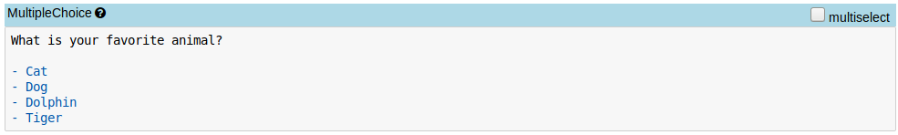
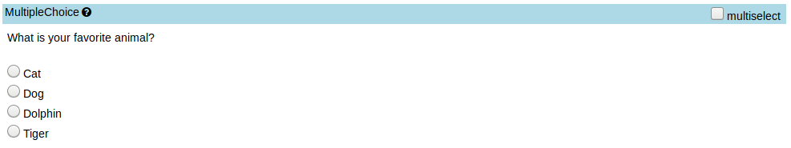
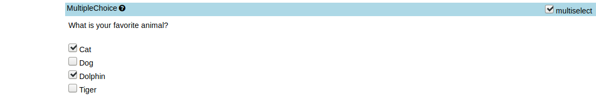

# Multiple choice cell

Adds a new cell type for multiple choice cells that extends markdown cells.

Each line in a multiple choice cell that starts with a ```-``` will be converted to an option.

A checkbox allows to toggle between being able to select just one or many options.

The selected option(s) are stored in the cells metadata:

```
   "metadata": {
    "extended_type": {
      "type": "multiplechoice",
      "multiselect": false,
      "choices": ["selected_option_1", "selected_option_2"]
    }
```

## Example

The unrendered cell looks like this:



The rendered cell with single select:



The rendered cell with multi select:


